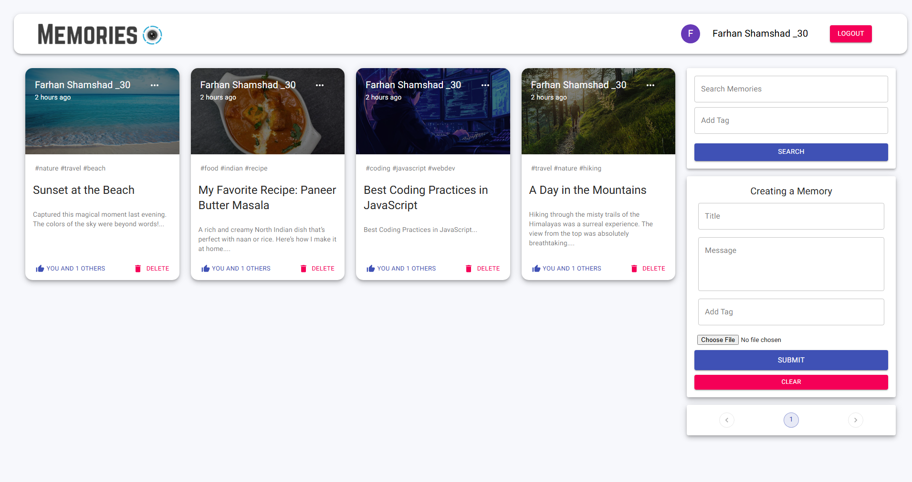
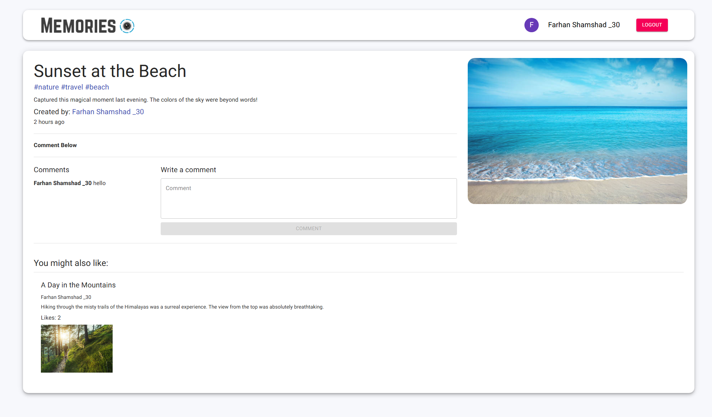
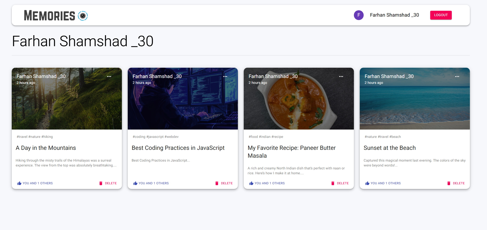

# 📸 Memories – A MERN Stack Social Sharing App

**Memories** is a full-stack social media web application where users can sign in using Google OAuth, create and share posts, like and comment on others’ posts, search for content using tags or keywords, and view suggested related posts. Each user has their own profile showing all of their submitted posts. The app is built using the MERN stack (MongoDB, Express, React, Node.js) and styled with Material-UI.



---

## 🚀 Features

- 🔐 Google OAuth Login and JWT Authentication
- 📝 Create, edit, delete posts (CRUD functionality)
- ❤️ Like and 💬 comment on posts
- 🔎 Search by title or tags
- 🧵 Suggested related posts section
- 📄 Pagination for large content lists
- 👤 User profiles with all their posts

---

## 🧰 Tech Stack

### 🖥️ Frontend (React)

| Library / Tool          | Purpose                         |
|-------------------------|----------------------------------|
| `react`, `react-dom`    | Core frontend rendering         |
| `redux`, `react-redux`  | Global state management         |
| `redux-thunk`           | Async Redux actions             |
| `react-router-dom`      | Frontend routing                |
| `@material-ui/core`     | UI components                   |
| `@material-ui/icons`    | Icons                           |
| `@material-ui/lab`      | Experimental UI (e.g. Pagination)|
| `react-file-base64`     | File uploads                    |
| `@react-oauth/google`   | Google Sign-In (modern)         |
| `jwt-decode`            | Decode JWTs                     |
| `moment`                | Format timestamps               |
| `axios`                 | API requests                    |

### 🌐 Backend (Node.js + Express)

| Library / Tool     | Purpose                            |
|--------------------|-------------------------------------|
| `express`          | Server framework                   |
| `mongoose`         | MongoDB ODM                        |
| `jsonwebtoken`     | JWT authentication                 |
| `bcryptjs`         | Password hashing (assumed)         |
| `cors`             | Enable cross-origin requests       |
| `dotenv`           | Manage environment variables       |
| `nodemon`          | Dev mode auto-restart              |

### 🛢️ Database

- **MongoDB Atlas** – Cloud-hosted NoSQL database

---

## 🗂️ Project Folder Structure

```
memories/
├── client/               # React frontend
│   ├── src/
│   │   ├── components/   # Reusable components (Posts, Form, Auth, etc.)
│   │   ├── pages/        # Routes like Home, Profile
│   │   ├── App.js
│   │   └── index.js
├── server/               # Node.js backend
│   ├── controllers/      # Route logic
│   ├── models/           # MongoDB schemas
│   ├── routes/           # Express route definitions
│   ├── middleware/       # Auth middleware
│   ├── index.js          # Server entry point
├── .env
├── package.json
└── README.md
```

---

## 🧑‍💻 Setup & Installation

### 1️⃣ Clone the Repository

```bash
git clone https://github.com/Farhan3112/Memories_MERN.git
cd Memories_MERN
```

---

### 2️⃣ Backend Setup (`server`)

```bash
cd server
npm install
```

#### Create `.env` File:

```env
PORT=5000
CONNECTION_URL=your_mongodb_connection_string
```

Start the backend:

```bash
npm start
```

App will run at: `http://localhost:5000`

---

### 3️⃣ Frontend Setup (`client`)

```bash
cd client
npm install
```

#### Create `.env` File:

```env
REACT_APP_API_URL=backend_api_url
REACT_APP_GOOGLE_CLIENT_ID=google_oauth_client_id
```

App will run at: `http://localhost:3000`

---

## 🌐 Live Demo

🔗 [Live App on Render](https://memories-client-i4nq.onrender.com/posts)

---

## 🔥 API Endpoints (Examples)

```http
GET     /posts
POST    /posts
PATCH   /posts/:id
DELETE  /posts/:id
POST    /user/signin
POST    /user/signup
GET     /posts/search?query=abc
GET     /posts/:id
```

---

## 🖼️ Screenshots

### 🏠 Home Page


---

### 📝 Post Details


---

### 👤 Profile Page


---

## 📜 License

This project is licensed under the MIT License.

---

## 👨‍💻 Author

**Farhan Shamshad**  
[GitHub](https://github.com/farhanshamshad)
